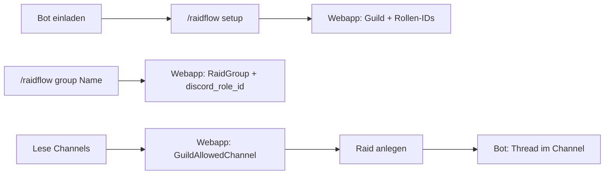

# RaidFlow – Discord-Bot Funktionalitäten

Zusammenfassung aller Funktionalitäten des RaidFlow-Discord-Bots. Der Bot verbindet sich mit Discord-Servern und arbeitet mit der RaidFlow-Webapplikation zusammen (Server-ID, Rollen-IDs und erlaubte Channels werden in der Webapp hinterlegt).

---

## 0. Rechte für Bot-Einladung, Setup und Raidgruppen

**Anforderung:** Die Einladung des Bots auf einen Server, das Setup (`/raidflow setup`) und die Anlage weiterer Gruppen (`/raidflow group`) dürfen **nur** für Nutzer möglich sein, die auf dem jeweiligen Discord-Server **Gründer (Owner)** oder **Manager**-Rechte haben.

### Discord-Standard: Prüfung im Bot

Discord kennt keinen eigenen „Manager“-Begriff; maßgeblich sind die **Server-Owner-Eigenschaft** und die **Berechtigungs-Bits** der Rollen des Nutzers. Es wird gegen folgende Größen geprüft:

| Bedeutung in RaidFlow | Discord-API / Client | Technische Prüfung |
|------------------------|----------------------|---------------------|
| **Gründer** | Server-Owner (genau ein Nutzer pro Server) | `guild.owner_id === member.user.id` (REST: `guild.owner` bzw. in der Guild-Resource das Feld `owner_id`) |
| **Manager** („Server verwalten“) | Berechtigung **Manage Server** | Berechtigungs-Bit **MANAGE_GUILD** = `0x20` (1 << 5). Prüfung: `(member.permissions.bitfield & MANAGE_GUILD) === MANAGE_GUILD` bzw. discord.js: `member.permissions.has(PermissionsBitField.Flags.ManageGuild)` |
| **Manager** (alle Rechte) | Berechtigung **Administrator** | Berechtigungs-Bit **ADMINISTRATOR** = `0x8` (1 << 3). Prüfung: `(member.permissions.bitfield & ADMINISTRATOR) === ADMINISTRATOR` bzw. discord.js: `member.permissions.has(PermissionsBitField.Flags.Administrator)` |

**Logik:** Der Nutzer darf die Aktion ausführen, wenn **mindestens eine** der Bedingungen zutrifft:

- Er ist **Server-Owner** (`guild.owner_id === user.id`), **oder**
- Er hat die Berechtigung **ADMINISTRATOR**, **oder**
- Er hat die Berechtigung **MANAGE_GUILD**.

(ADMINISTRATOR umfasst in Discord alle Rechte inkl. MANAGE_GUILD; zur Klarheit werden beide explizit genannt.)

### Wo gilt die Prüfung?

- **Bot-Einladung (Webapp):** Der Einladungslink fügt den Bot einem **bestimmten Server** hinzu. Die Webapp soll den Link nur anzeigen bzw. die Auswahl „Bot zu Server X einladen“ nur für Server anbieten, auf denen der eingeloggte User Owner oder Manager ist. Dafür muss die Webapp (über Bot-API oder OAuth2) die Guilds des Users und pro Guild prüfen: ob der User `owner_id` ist oder in seinen Rollen die Bits ADMINISTRATOR oder MANAGE_GUILD gesetzt sind (z. B. über **GET /users/@me/guilds** mit `permissions` im Response nutzen, sofern der Bot die nötigen OAuth2-Scopes hat).
- **`/raidflow setup` (im Bot):** Vor dem Anlegen des Servers in der Webapp und dem Erstellen der Rollen prüft der Bot: `interaction.member` ist Server-Owner ODER hat ADMINISTRATOR ODER MANAGE_GUILD. Andernfalls Befehl mit Fehlermeldung ablehnen.
- **`/raidflow group <Groupname>` (im Bot):** Gleiche Prüfung wie bei Setup – nur Server-Owner oder Nutzer mit ADMINISTRATOR bzw. MANAGE_GUILD dürfen neue Raidgruppen anlegen.

**Referenz Discord-Dokumentation:** [Permissions (Bitwise Permission Flags)](https://discord.com/developers/docs/topics/permissions) – ADMINISTRATOR, MANAGE_GUILD; [Guild Object](https://discord.com/developers/docs/resources/guild) – `owner_id`.

---

## 1. Verbindung und Setup

- **Serververbindung**: Der Bot verbindet sich mit dem Discord-Server, sobald er eingeladen wurde.
- **Slash-Command `/raidflow setup`**:
  - **Rechte:** Nur ausführbar von Nutzern mit **Gründer-** oder **Manager-**Rechten auf dem Server (siehe Abschnitt 0).
  - **Server in Webapp anlegen**: Die Discord-Server-ID (Guild-ID) wird in der Webapplikation gespeichert (Gilde/Guild-Eintrag).
  - **Basis-Rollen anlegen**: Der Bot erstellt auf dem Discord-Server die folgenden Rollen und speichert deren IDs in der Webapp:
    - **RaidFlow-Gildenmeister** (für Gildenverwaltung in der Webapp)
    - **RaidFlow-Raidleader** (für Raidplaner-Funktionen)
    - **RaidFlow-Raider** (für Anzeige und Teilnahme an Raids)
  - Die Rollen-IDs werden im Guild-Datensatz der Webapp hinterlegt (`discord_role_guildmaster_id`, `discord_role_raidleader_id`, `discord_role_raider_id`).

---

## 2. Raidgruppen (Discord-Rollen)

- **Slash-Command `/raidflow group <Groupname>`**:
  - **Rechte:** Nur ausführbar von Nutzern mit **Gründer-** oder **Manager-**Rechten auf dem Server (siehe Abschnitt 0).
  - Erstellt auf dem Discord-Server die Rolle **Raidflowgroup-<Groupname>** (exakter Rollenname mit diesem Präfix).
  - In der Webapplikation wird die Raidgruppe angelegt bzw. aktualisiert: Gruppennamen und die zugehörige **Discord-Rollen-ID** werden gespeichert (Tabelle RaidGroup: `name`, `discord_role_id`).
  - Ermöglicht die Einschränkung von Raids auf eine bestimmte Gruppe und die rechtebasierte Anzeige/Teilnahme (User brauchen RaidFlow-Raider + ggf. Raidflowgroup-<Group>).

---

## 3. Channels lesen und erlaubte Thread-Channels

- **Funktion „Lese Channels“ (aus der Gildenverwaltung)**:
  - Wird von der Webapp ausgelöst (z. B. Button in der Gildenverwaltung); die Webapp fordert beim Bot die Liste aller Text-Channels des Servers an.
  - Der Bot liest alle relevanten Discord-Channels des Servers aus und stellt sie der Webapp als Liste (z. B. für ein Dropdown) zur Verfügung.
- **Channel-Auswahl durch Gildenmeister**:
  - In der Gildenverwaltung wählen Nutzer mit der Rolle **RaidFlow-Gildenmeister** die Channels aus, in denen der Bot **Raid-Threads erstellen darf**.
  - Diese Auswahl wird in der Webapp gespeichert (Tabelle GuildAllowedChannel: pro Gilde die erlaubten Channel-IDs).
- **Anzeige beim Raidplaner (Neuer Raid)**:
  - Beim Anlegen eines neuen Raids wird in der Webapp ein Dropdown mit genau diesen erlaubten Channels angezeigt; der Raidleader wählt den Channel, in dem der Raid-Thread erscheinen soll.
- **Sicherheitsprüfung**:
  - Bevor ein Channel in der Auswahl genutzt wird (oder periodisch beim Laden), wird geprüft, ob der Channel auf dem Discord-Server noch existiert.
  - Wenn ein Channel nicht mehr existiert, wird er aus der gespeicherten Auswahl (GuildAllowedChannel) entfernt und erscheint nicht mehr im Dropdown.

---

## 4. Raid-Threads

- **Thread-Erstellung**:
  - Wenn beim Anlegen oder Veröffentlichen eines Raids die Option „Discord-Thread anlegen“ gewählt ist, erstellt der Bot einen Thread in dem in der Webapp ausgewählten (erlaubten) Channel.
  - Die Thread-ID wird in der Webapp am Raid gespeichert (`discord_thread_id`); die Channel-ID wird ebenfalls gespeichert (`discord_channel_id`).
- **Thread-Aktualisierung**:
  - Der Bot aktualisiert den Raid-Thread bei relevanten Ereignissen (z. B. neue Anmeldungen, Raid „gesetzt“, Raid abgeschlossen), sodass der Inhalt (siehe unten) und „Mein Status“ sowie die Links aktuell sind.
- **Benachrichtigungen**:
  - Wenn ein Raid „gesetzt“ wird, können Spieler über Discord (z. B. im Thread oder per Hinweis) informiert werden.

### 4.1 Thread-Inhalt (minimalistisch)

Der Raid-Thread soll **minimalistisch** bleiben. Im Thread werden angezeigt:

| Inhalt | Beschreibung |
|--------|--------------|
| **Dungeon** | Name des Raid-Dungeons (z. B. Karazhan, SSC). |
| **Name** | Raid-Name (Alternativname aus der Webapp). |
| **Anmeldungen** | Anzahl Anmeldungen und Maximum im Format **Anmeldungen / max_players** (z. B. „12 / 25“). |
| **Fehlende Mindestbesetzung** | Welche Rollen oder Specs noch fehlen (z. B. „Tank: -1, Fire Mage: -1“), damit auf einen Blick erkennbar ist, was für den Raid noch benötigt wird. |
| **Eigener Status** | Für den lesenden User: **„Mein Status:“** mit dem eigenen Anmeldestatus (normal / unsicher / Reserve, ggf. „Reserve erlauben?“, „Gesetzt“), sofern der User für diesen Raid berechtigt ist und ggf. angemeldet ist. |
| **Sichtbarkeit nach Rechten** | Die **Webapp** zeigt nur Raids, für die der User die nötigen Rollen hat (RaidFlow-Raider; bei Raidgruppen-Einschränkung zusätzlich Raidflowgroup-&lt;Name&gt;). Im **Discord-Thread** ist die Nachricht für alle Leser sichtbar (ein Raid pro Thread); **„Mein Status“** kann pro User unterschiedlich sein (nur für berechtigte/angemeldete User befüllt). Die **Links** in den Browser führen in die Webapp und unterliegen dort der **Berechtigungsprüfung** – ohne Rechte erfolgt Redirect/Fehlerseite, keine Anzeige geschützter Daten. |
| **Link: Raid im Browser** | Ein **Link**, mit dem der Raid **direkt in der Webapp im Browser** geöffnet werden kann (Raid-Detail-Ansicht). Der Aufruf erfolgt über eine **stabile URL**; die **Berechtigungsprüfung** (RaidFlow-Raider, ggf. Raidflowgroup) wird **bei jedem Aufruf** in der Webapp durchgeführt – die URL umgeht die Prüfung nicht. |
| **Link: Raid-Teilnahme im Browser** | Ein **Link**, mit dem **direkt die Raid-Teilnahme** (Anmelden/Abmelden/Status) in der Webapp im Browser aufgerufen werden kann. Ebenfalls über **stabile URL**, mit **Berechtigungsprüfung bei jedem Aufruf** (kein Umgehen der Prüfung). |

**Technik:** Die Links sind z. B. `https://<app>/<locale>/guild/<guildId>/raid/<raidId>` (Raid ansehen) und `https://<app>/<locale>/guild/<guildId>/raid/<raidId>/signup` (Teilnahme). Beim Öffnen der URL prüft die Webapp Session/Login und Rollen; bei fehlender Berechtigung: Fehlerseite oder Redirect (z. B. Login/Dashboard), nicht Anzeige geschützter Daten.

---

## 5. Rechteverwaltung (Zusammenfassung)

Die Rechte werden über Discord-Rollen gesteuert; die Webapp prüft die Rollen-Zugehörigkeit (über Bot/API):

| Bereich | Erforderliche Discord-Rolle |
|---------|-----------------------------|
| **Gildenverwaltung** (Channels lesen, Channel-Auswahl, Raidgruppen, Mitglieder) | RaidFlow-Gildenmeister |
| **Raidplaner** (Neuer Raid, Bearbeiten, Setzen, Abschließen) | RaidFlow-Raidleader |
| **Raid anzeigen und teilnehmen** | RaidFlow-Raider; bei Raidgruppen-Einschränkung zusätzlich Raidflowgroup-<Group> |
| **Admin-Menü** (Webapp) | Application-Admin (Discord-ID in Admin-Liste oder Owner); wird nicht vom Bot vergeben, sondern in der Webapp konfiguriert |

Der Bot legt nur die Server-Rollen (RaidFlow-Gildenmeister, RaidFlow-Raidleader, RaidFlow-Raider, Raidflowgroup-*) an und speichert deren IDs in der Webapp. Die Zuordnung „Wer ist Gildenmeister/Raidleader/Raider“ erfolgt durch die Rollenvergabe auf dem Discord-Server (durch Server-Admins).

---

## 6. Datenminimierung

Bot und Webapp tauschen nur die für den Betrieb nötigen Daten aus:

- **Gespeichert in der Webapp:** Server-ID (Guild), Rollen-IDs (Basis-Rollen und Raidflowgroup-*), Channel-IDs (erlaubte Thread-Channels), Thread-IDs (pro Raid). User-Identifikation über `discord_id` (User), keine weiteren Nutzerdaten.
- **Nicht persistieren:** Keine User-E-Mail, keine User-Namen (Username/Display-Name) vom Bot in der Webapp speichern. Rollenprüfung erfolgt über Discord (Bot/API); die Webapp speichert nur die **Rollen-IDs** der Rollen (RaidFlow-Gildenmeister etc.), nicht Nutzerprofile oder personenbezogene Daten von Mitgliedern.

Siehe auch [project.md](project.md) (Discord-Datenminimierung) und [db_schema.md](db_schema.md) (User-Tabelle).

---

## 7. Ablaufübersicht

---

## 8. Referenzen

- **Rechte Einladung/Setup/Gruppen:** Abschnitt 0 (Owner, ADMINISTRATOR, MANAGE_GUILD); [project.md](project.md), [functions.md](functions.md) `Discord.bot.invite.server_rights`.
- **Webapp UI**: [UI.md](UI.md) – Gildenverwaltung (Lese Channels, Channel-Auswahl), Neuer Raid (Channel-Dropdown), Rechte (Burger-Menü, Sichtbarkeit), Bot-Einladung nur für berechtigte Server; Raid-Thread Inhalt und Links (Abschnitt 4.1), [UI.md](UI.md) 7.2 und 7.3 (URL-Struktur).
- **Funktionen**: [functions.md](functions.md) – Discord.bot.*, Discord.bot.invite.server_rights, Guild.allowed_thread_channels, Guild.channel_validation, Rights.*.
- **Datenbank**: [db_schema.md](db_schema.md) – Guild (discord_role_*_id), RaidGroup (discord_role_id), GuildAllowedChannel, Raid (discord_channel_id, discord_thread_id).
